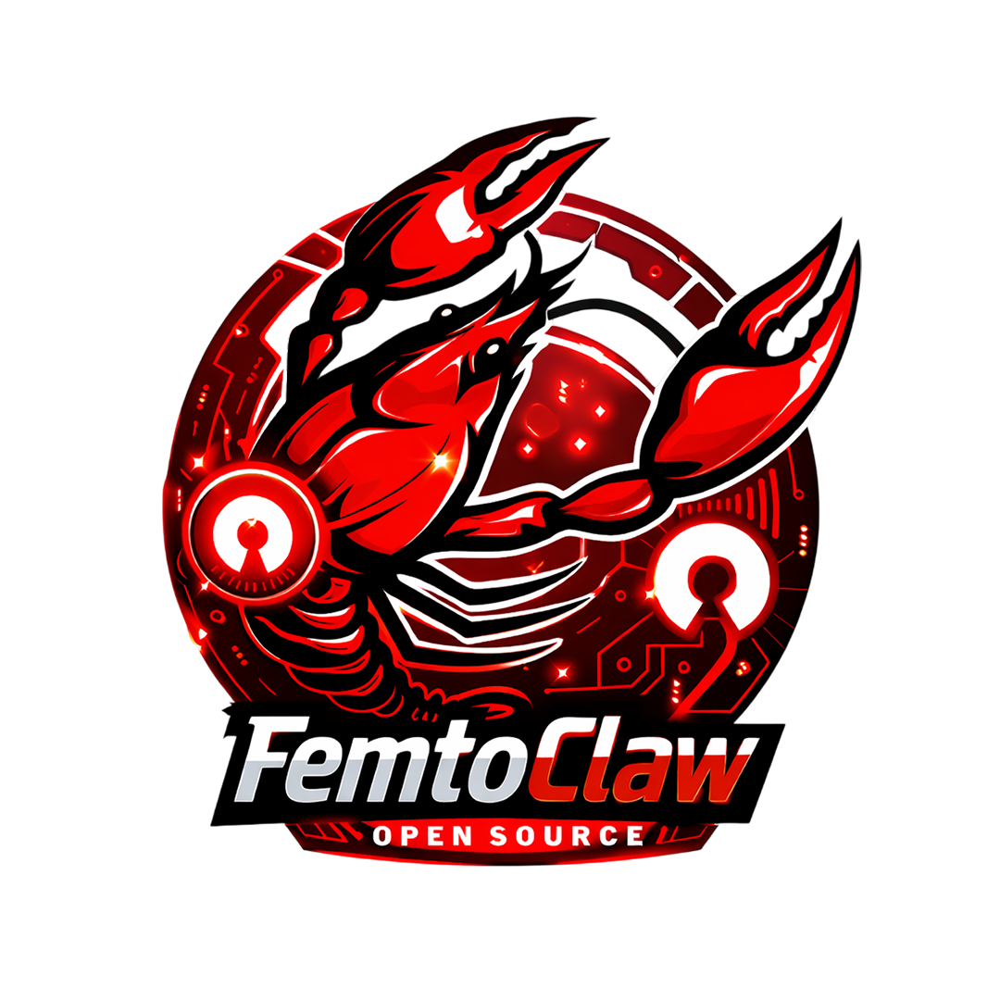
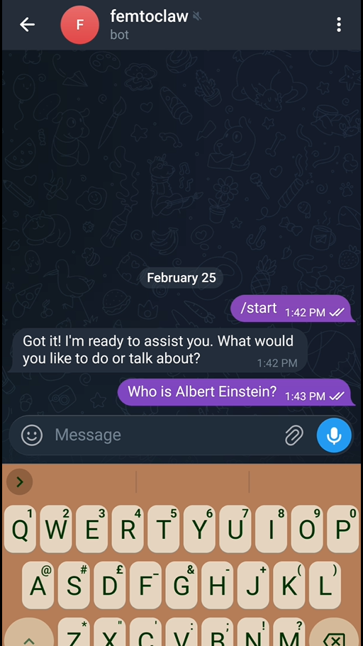
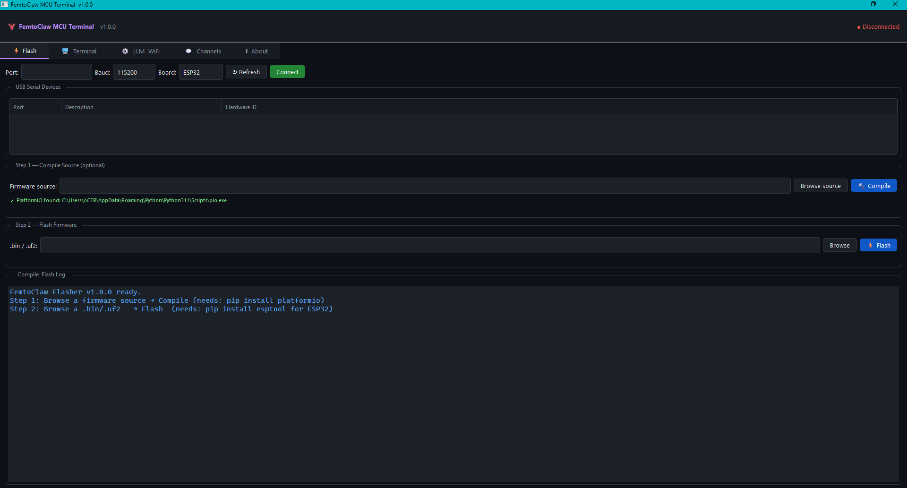
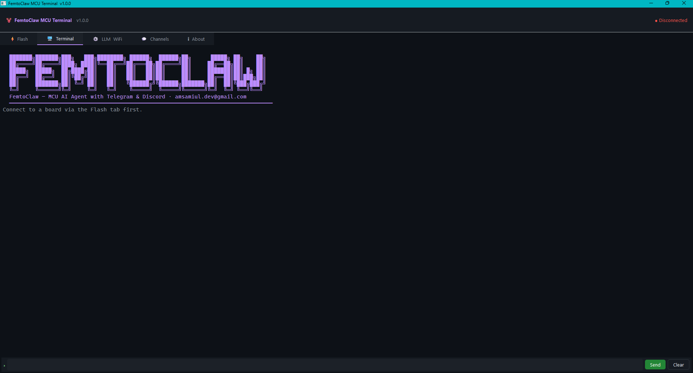
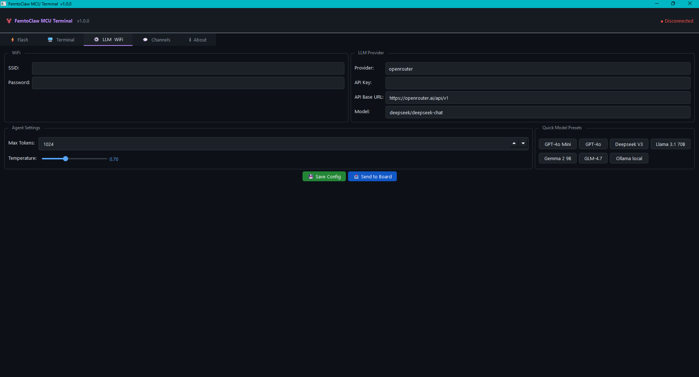
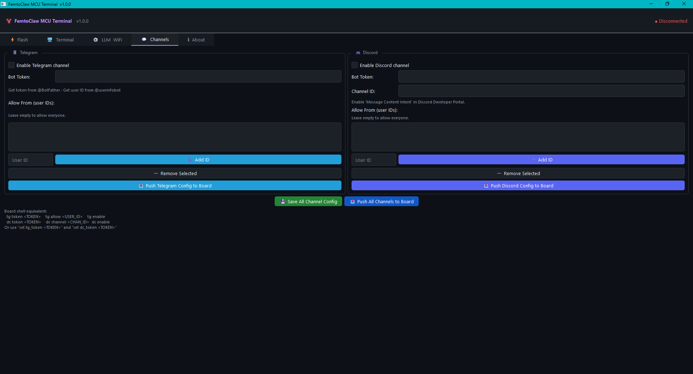

# FemtoClaw : MCU AI Assistant with Telegram & Discord

<p align="center">
  
</p>

Ultra-lightweight MCU port of [PicoClaw](https://github.com/sipeed/picoclaw) for
WiFi-capable boards (ESP32, Pico W), with a Python GUI that handles everything
compiling the firmware, flashing it and running a live terminal "all in one app".

---

## Files

| File                | Purpose                                                                 |
| ------------------- | ----------------------------------------------------------------------- |
| `femtoclaw_mcu.cpp` | C++ firmware for ESP32 / ESP32-C3 / Pico W                              |
| `platformio.ini`    | PlatformIO multi-board build config (auto-generated if missing)         |
| `femtoclaw.py`      | **PyQt6 GUI** with real transparency — compile, flash, terminal, config |

---

## Requirements

### Core Dependencies

```bash
pip install PyQt6              # GUI framework
pip install pyserial           # Serial port communication
pip install platformio         # Compile firmware (auto-detected)
pip install esptool            # Flash ESP32 boards
```

**Pico W:** Uses drag-and-drop `.uf2` or `picotool` - no `esptool` needed.

---

## Demos

<https://github.com/user-attachments/assets/e881f5f5-d829-4c6f-b895-254bb5adc508>

### Telegram Demo
[](https://youtube.com/shorts/vIlKrQSQUu8?feature=share)

---

## Quick Start
1. Clone the project
```bash
git clone https://github.com/samiul000/femtoclaw.git
```
2. Go to the main folder
```bash
cd femtoclaw-main/main/
```
3. Run
```bash
python femtoclaw.py
```

The GUI launches and auto-detects all USB serial devices.

---

## GUI Overview — 5 Tabs

<table align="center">
  <tr align="center">
    <th><p align="center">⚡Flash & Compile Tab</p></th>
    <th><p align="center">🖥UART Terminal</p></th>
    <th><p align="center">⚙LLM & WiFi Tab</p></th>
    <th><p align="center">💬Channels Tab</p></th>
  </tr>
  <tr>
    <td align="center"><p align="center"></p></td>
    <td align="center"><p align="center"></p></td>
    <td align="center"><p align="center"></p></td>
    <td align="center"><p align="center"></p></td>
  </tr>

</table>

### ⚡ Flash Tab

Complete compile → flash pipeline in two steps.

**Step 1 — Compile Source**

| Control     | What it does                                                     |
|-------------| ---------------------------------------------------------------- |
| Browse .cpp | Select `femtoclaw_mcu.cpp` (or renamed copy)                     |
| 🔨 Compile  | Runs PlatformIO, streams compiler output to log                  |
| Status hint | Shows `✓ PlatformIO found` or `✗ not found` with install command |

**Compile workflow:**

1. **Auto-detects PlatformIO** in multiple locations:
   - Current Python venv (PyCharm, VS Code)
   - pipx installations
   - System PATH
   - User-level pip installs (`~/.local/bin`)
   - PlatformIO standalone installer paths

2. **Auto-generates `platformio.ini`** if missing with:
   - Correct board configuration (ESP32/ESP32-S3/ESP32-C3/Pico W)
   - Build flags (`-DBOARD_ESP32` or `-DBOARD_PICO_W`)
   - Optimization settings (`-Os`, link-time optimization)

**Flash Firmware**

| Control      | What it does                                                 |
| ------------ | ------------------------------------------------------------ |
| Browse…      | Manually select `.bin` or `.uf2` (auto-filled after compile) |
| ⚡ Flash     | Flash via `esptool` (ESP32) or drag-drop UF2 (Pico W)        |
| Progress bar | Animated during compile/flash operations                     |

**USB Serial Devices Table:**

- Auto-refreshes every 3 seconds
- Highlights recognized ESP32/CH340/CP210x/FTDI chips in green
- Click any row to auto-select that port
- Shows: Port, Description, Hardware ID

---

### 🖥 Terminal Tab

Full-featured UART terminal with Linux shell aesthetics.

**Features:**

- **Color-coded output:**
  - 🟣 Purple: Agent replies (`[femtoclaw]`)
  - 🔵 Cyan: Telegram events (`[Telegram]`)
  - 🟦 Indigo: Discord events (`[Discord]`)
  - 🟠 Orange: Tool calls (`[tool:set_config]`, etc.)
  - 🔴 Red: Errors
  - 🟢 Green: Success messages
  - 🔵 Blue: WiFi/Info events
- **Command history:** ↑/↓ arrow keys browse previous commands
- **Tab completion:** Auto-completes `tg`, `dc`, `set`, `wifi`, `chat`, etc.
- **Real-time streaming:** No buffering lag during long responses

---

### ⚙️ LLM & WiFi Tab

Configure WiFi and LLM providers with instant push to board.

**WiFi Section:**

- SSID
- Password (hidden input)

**LLM Provider Section:**

- Provider dropdown: OpenRouter, OpenAI, Anthropic, DeepSeek, Groq, Zhipu GLM, Ollama
- API Key (password-style hidden input)
- API Base URL
- Model name

**Agent Settings:**

- Max Tokens: 128–8192 (adjustable spinner)
- Temperature: 0.0–2.0 (slider with live value display)

**Quick Model Presets:**
One-click buttons for popular models:

- GPT-4o Mini / GPT-4o
- Deepseek V3
- Llama 3.1 70B (Groq)
- Gemma 2 9B (Groq)
- GLM-4.7 (Zhipu)
- Ollama local

**Actions:**

- **💾 Save Config** → Export to `femtoclaw_config.json`
- **📤 Send to Board** → Push config via UART **without re-flashing**

---

### 💬 Channels Tab

Full Telegram and Discord bot configuration with GUI list management.

**Telegram Section:**

- ☑️ Enable/disable toggle
- 🔑 Bot token
- 👥 `allow_from` list with Add/Remove buttons
  - Empty list = allow everyone
  - Add user IDs from [@userinfobot](https://t.me/userinfobot)
- Helper text: "Get token from `@BotFather` · Get user ID from `@userinfobot`"
- **📤 Push Telegram Config to Board** — Sends `tg token`, `tg allow` (for each ID), `tg enable` automatically

**Discord Section:**

- ☑️ Enable/disable toggle
- 🔑 Bot token
- 📺 Channel ID field
- 👥 `allow_from` list with Add/Remove buttons
  - Empty list = allow everyone
  - Get user IDs via Developer Mode
- Helper text: "Enable 'Message Content Intent' in Discord Developer Portal"
- **📤 Push Discord Config to Board** — Sends `dc token`, `dc channel`, `dc allow`, `dc enable`

**Bulk Actions:**

- **💾 Save All Channel Config** — Save to in-memory config
- **📤 Push All Channels to Board** — Push both Telegram and Discord in one click

**Shell Equivalent Hint:**
Shows UART commands for users who prefer terminal:

```
tg token <TOKEN>    tg allow <USER_ID>    tg enable
dc token <TOKEN>    dc channel <CHAN_ID>  dc enable
```

---

## End-to-End Workflow

```
1.  python femtoclaw.py
2.  Flash tab → select board (ESP32/ESP32-C3/Pico W) + COM port from table
3.  Step 1 → Browse femtoclaw_mcu.cpp → 🔨 Compile
              • platformio.ini auto-created if missing
              • Real-time compilation log with colors
              • Firmware path auto-filled on success
4.  Step 2 → ⚡ Flash
              • esptool for ESP32 (auto-detects chip type)
              • UF2 drag-drop instructions for Pico W
5.  Terminal tab → board reboots, FemtoClaw ASCII banner appears
6.  femtoclaw> wifi MySSID MyPassword
    femtoclaw> connect
7.  LLM & WiFi tab → enter API key + model → 📤 Send to Board
8.  Channels tab → enter bot tokens → 📤 Push All Channels to Board
9.  femtoclaw> chat Hello, what can you do?
```

---

## Supported Boards

| Board                    | PlatformIO env | Flash format       | Notes                                        |
| ------------------------ | -------------- | ------------------ | -------------------------------------------- |
| **ESP32 (WROOM/WROVER)** | `esp32`        | `.bin` via esptool | Generic devkit, most common                  |
| **ESP32-S3**             | `esp32s3`      | `.bin` via esptool | Dual-core Xtensa LX7                         |
| **ESP32-C3**             | `esp32c3`      | `.bin` via esptool | RISC-V single-core                           |
| **ESP32-C3 Super Mini**  | `esp32c3`      | `.bin` via esptool | **✅ Tested & Verified** => tiny USB-C board |
| **Raspberry Pi Pico W**  | `picow`        | `.uf2` drag-drop   | RP2040 + CYW43439 WiFi                       |

### ESP32-C3 Super Mini Details (Used for Testing)

The **ESP32-C3 Super Mini** is fully supported and works perfectly:

**Hardware:**

- Ultra-compact size (smaller than a thumb)
- ESP32-C3FH4 chip (RISC-V @ 160 MHz)
- 4 MB flash, 400 KB RAM
- Built-in USB-C (no UART chip needed)
- Native USB-CDC (shows as `ttyACM0` on Linux, `COM3` on Windows)

**Flashing:**

- Most boards auto-enter flash mode when esptool sends reset signal
- Some clones require manual boot mode:
  1. Unplug board
  2. Hold **BOOT button**
  3. Plug in USB (while holding BOOT)
  4. Release BOOT
  5. Click ⚡ Flash

**Memory Budget:**

- FemtoClaw uses ~64 KB RAM and ~1 MB flash
- Super Mini has **6× RAM headroom** (400 KB available)
- Super Mini has **4× flash headroom** (4 MB available)
- Can run multiple agent instances with room to spare

---

## Communication Channels

| Channel        | Implementation            | Polling Interval | Notes                            |
| -------------- | ------------------------- | ---------------- | -------------------------------- |
| **UART shell** | Always on                 | N/A              | USB-CDC or hardware UART0        |
| **Telegram**   | Long-polling `getUpdates` | 2 seconds        | No webhook server needed         |
| **Discord**    | HTTP REST polling         | 5 seconds        | No WebSocket (too heavy for MCU) |

### Message Chunking

Large responses are automatically split:

- **Telegram:** 4,000 chars per message (4,096 limit - 96 byte margin)
- **Discord:** 1,900 chars per message (2,000 limit - 100 byte margin)

---

## Setting Up Telegram

### Option 1: GUI (Recommended)

1. Get bot token from [@BotFather](https://t.me/BotFather):
   - Send `/newbot`
   - Follow prompts
   - Copy token (format: `123456:ABC-DEF...`)

2. Get your user ID from [@userinfobot](https://t.me/userinfobot):
   - Send any message
   - Copy numeric ID (e.g., `123456789`)

3. **Channels tab:**
   - ☑️ Enable Telegram
   - Paste bot token
   - Add your user ID to allow_from list (optional, leave empty to allow all)
   - Click **📤 Push Telegram Config to Board**

### Option 2: UART Shell

```
femtoclaw> tg token 123456:ABCDEFghij...
femtoclaw> tg allow 123456789
femtoclaw> tg enable
```

---

## Setting Up Discord

### Option 1: GUI (Recommended)

1. [Discord Developer Portal](https://discord.com/developers/applications) → **New Application**

2. **Bot** section:
   - Click **Add Bot** → Confirm
   - Enable **Message Content Intent** (required!)
   - Copy bot token

3. **OAuth2 → URL Generator**:
   - Scopes: `bot`
   - Permissions: `Send Messages`, `Read Message History`
   - Copy generated URL → Open in browser → Invite to your server

4. **Get Channel ID**:
   - Discord Settings → Advanced → Enable **Developer Mode**
   - Right-click target channel → **Copy Channel ID**

5. **Channels tab:**
   - ☑️ Enable Discord
   - Paste bot token + channel ID
   - Add user IDs to allow_from (optional)
   - Click **📤 Push Discord Config to Board**

### Option 2: UART Shell

```
femtoclaw> dc token YOUR_BOT_TOKEN
femtoclaw> dc channel 1234567890123456789
femtoclaw> dc allow YOUR_USER_ID
femtoclaw> dc enable
```

---

## UART Shell Reference

### Basic Commands

```
femtoclaw> help                          # Show all commands
femtoclaw> status                        # WiFi, channels, model, uptime
femtoclaw> reboot                        # Restart MCU
```

### WiFi Commands

```
femtoclaw> wifi <ssid> <password>        # Save WiFi credentials
femtoclaw> connect                       # (Re)connect to WiFi
```

### LLM Commands

```
femtoclaw> set llm_api_key sk-...
femtoclaw> set llm_model gpt-4o-mini
femtoclaw> set llm_provider openrouter
femtoclaw> set llm_api_base https://openrouter.ai/api/v1
femtoclaw> show config                   # Display all config
```

### Telegram Commands

```
femtoclaw> tg token <BOT_TOKEN>
femtoclaw> tg allow <USER_ID>            # Empty = allow everyone
femtoclaw> tg enable
femtoclaw> tg disable
```

### Discord Commands

```
femtoclaw> dc token <BOT_TOKEN>
femtoclaw> dc channel <CHANNEL_ID>
femtoclaw> dc allow <USER_ID>
femtoclaw> dc enable
femtoclaw> dc disable
```

### Chat Commands

```
femtoclaw> chat Hello, what can you do?  # Send message to LLM
femtoclaw> reset session                 # Clear conversation history
```

---

## Supported LLM Providers

| Provider       | `llm_api_base`                         | Notes                     |
| -------------- | -------------------------------------- | ------------------------- |
| **OpenRouter** | `https://openrouter.ai/api/v1`         | Aggregator, many models   |
| **OpenAI**     | `https://api.openai.com/v1`            | GPT-4o, GPT-4o-mini       |
| **Anthropic**  | `https://api.anthropic.com/v1`         | Claude 3.5 Sonnet         |
| **DeepSeek**   | `https://api.deepseek.com/v1`          | DeepSeek V3               |
| **Groq**       | `https://api.groq.com/openai/v1`       | Fast inference, free tier |
| **Zhipu GLM**  | `https://open.bigmodel.cn/api/paas/v4` | GLM-4                     |
| **Ollama**     | `http://localhost:11434/v1`            | Local models              |

---

## Configuration System

### How Config Updates Work

FemtoClaw uses a **partial update (merge)** system, NOT full replacement:

✅ **Only keys you send get updated**  
✅ **Unsent keys remain unchanged**  
✅ **Changes persist immediately** (survives reboot)  
❌ **NOT a full rewrite** — old values persist unless explicitly overwritten

**_Note_** : _Read CONFIG.md for more information._

**Example:**

```json
// Current config on board
{
  "wifi_ssid": "MyHomeWiFi",
  "llm_api_key": "sk-old-key",
  "llm_model": "gpt-4o-mini"
}

// You push from GUI (only 1 field)
set llm_api_key sk-new-key

// Result
{
  "wifi_ssid": "MyHomeWiFi",      // ✅ UNCHANGED
  "llm_api_key": "sk-new-key",     // ⬅️ UPDATED
  "llm_model": "gpt-4o-mini"       // ✅ UNCHANGED
}
```

### Storage Backends

| Platform   | Storage         | Location          | Update Behavior                |
| ---------- | --------------- | ----------------- | ------------------------------ |
| **ESP32**  | NVS (key-value) | Flash memory      | Per-key updates                |
| **Pico W** | LittleFS        | `/femtoclaw.json` | File rewritten (values merged) |

Both behave identically from user perspective, only changed keys are updated.

### Config Persistence

1. GUI sends: `set llm_model deepseek-chat`
2. Board updates: `g_cfg.llm_model = "deepseek-chat"` (in RAM)
3. Board saves: Writes **entire** `g_cfg` to storage immediately
4. Other fields: Preserved from previous values in `g_cfg`
5. Reboot: All values persist (read back from storage into `g_cfg`)

**Key insight:** The in-memory `g_cfg` struct is the single source of truth. Storage is just for persistence across reboots.

---

## Full Config JSON Example

```json
{
  "wifi_ssid": "MyNetwork",
  "wifi_pass": "secret",
  "llm_provider": "openrouter",
  "llm_api_key": "sk-or-v1-...",
  "llm_api_base": "https://openrouter.ai/api/v1",
  "llm_model": "openai/gpt-4o-mini",
  "max_tokens": 1024,
  "temperature": 0.7,
  "channels": {
    "telegram": {
      "enabled": true,
      "token": "123456:ABC...",
      "allow_from": ["123456789"]
    },
    "discord": {
      "enabled": true,
      "token": "YOUR_DISCORD_BOT_TOKEN",
      "channel_id": "1234567890123456789",
      "allow_from": []
    }
  }
}
```

---

## Architecture vs PicoClaw Go Source

| Feature              | PicoClaw (Go)                   | FemtoClaw (C++)                              |
| -------------------- | ------------------------------- |----------------------------------------------|
| **Telegram**         | `go-telegram-bot-api` long-poll | Hand-rolled HTTPS `getUpdates`               |
| **Discord**          | `discordgo` WebSocket gateway   | REST polling (no WebSocket on MCU)           |
| **Message chunking** | Automatic                       | 4 KB Telegram / 1.9 KB Discord               |
| **`allow_from`**     | JSON config file                | NVS (ESP32) / LittleFS (Pico W) + shell      |
| **Compile**          | `go build`                      | PlatformIO — auto-triggered from GUI         |
| **Flash**            | Manual / CI                     | esptool / picotool — auto-triggered from GUI |
| **GUI Framework**    | N/A                             | **PyQt6**                                    |
| **Memory**           | 10–20 MB (Go runtime)           | **~64 KB RAM** (static buffers, no heap)     |
| **Binary size**      | ~8 MB                           | **~1 MB flash**                              |
| **JSON**             | `encoding/json`                 | Zero-alloc hand-rolled tokenizer             |
| **Session history**  | `[]Message{}` heap slice        | Rolling 4 KB static ring buffer              |
| **Config storage**   | `~/.picoclaw/config.json`       | NVS (ESP32) / `/femtoclaw.json` (Pico W)     |
| **Config updates**   | Full file replace               | **Partial merge** (only changed keys)        |

---

## Performance Notes

### GUI Performance (PyQt6)

| Metric               | Value           |
| -------------------- | --------------- |
| **RAM usage**        | ~80 MB          |
| **Startup time**     | ~0.8s           |
| **Rendering**        | GPU-accelerated |
| **Terminal updates** | Real-time       |

### MCU Performance

- **Boot time:** <2 seconds (ESP32), <3 seconds (Pico W)
- **WiFi connect:** 3-5 seconds typical
- **LLM latency:** Network-dependent (200ms – 5s per request)
- **Telegram poll:** Every 2 seconds when enabled
- **Discord poll:** Every 5 seconds when enabled
- **Serial baud:** 115200 (configurable in platformio.ini)

---

## Troubleshooting

### "No module named 'PyQt6'"

```bash
pip install PyQt6
```

### "PlatformIO not found"

The GUI auto-searches:

- Current venv
- PyCharm/VS Code venv
- pipx installs
- System PATH
- User-level pip (`~/.local/bin`)

If still not found:

```bash
pip install platformio
```

Or check installation:

```bash
which pio  # Linux/macOS
where pio  # Windows
```

### "esptool not found"

```bash
pip install esptool
```

### "Serial port not detected"

```bash
pip install pyserial
```

**Linux permission fix:**

```bash
sudo usermod -a -G dialout $USER
# Log out and back in
```

**Localhost issue for Ollama:**

```bash
# For Windows run
ipconfig
# For Linux
ip -4 addr
# For MacOS
ipconfig getifaddr en0
# Copy the IPv4 address and paste it instead of localhost e.g. http://YOUR_IPV4_ADDRESS:11434/v1
```

### "Compile fails with 'env not found'"

The GUI auto-generates `platformio.ini` based on your board selection:

- ESP32/ESP32-S3/ESP32-C3 → `esp32`, `esp32s3`, `esp32c3`
- Pico W → `picow`

If manual ini exists, ensure env name matches board selection.

---

## Credits & License

**Developed by:** Al Mahmud Samiul  
**License:** Apache 2.0

---

## Additional Documentation

See the project repository for detailed guides:

- **[CONFIG.md](CONFIG.md)** — Partial config updates explained
- **[LICENSE.md](LICENSE.md)** — Licensing information
- **[TRADEMARK.md](TRADEMARK.md)** — Trademark condition explained

---

## Contributing

Contributions welcome! Open issues or PRs on GitHub. Please read **[CONTRIBUTE.md](CONTRIBUTE.md)** before opening issues or pull requests.

---

## Acknowledgments

Inspired by [PicoClaw](https://github.com/sipeed/picoclaw) by Sipeed. This project is not affiliated with Sipeed.
